# Assinc Manutenções

Projeto full-stack criado para apoiar a empresa onde atuo: identifiquei uma necessidade real de **organizar o controle de manutenção de computadores** (preventiva/corretiva) e **gerar relatórios** de forma prática, usando o GLPI como fonte de verdade dos ativos.

O objetivo é reduzir retrabalho e dar visibilidade: o GLPI continua sendo o inventário, e este sistema cuida do **processo de manutenção**, histórico e relatórios.

## O que este projeto resolve

- Mantém um **espelho local (MySQL)** dos computadores do GLPI via sincronização.
- Integração com o GLPI é **leitura para inventário** e **escrita pontual** para:
	- adicionar comentário (follow-up) no chamado vinculado à manutenção;
	- permitir visualizar uma **fila de chamados** (categoria **Computador**) na Home;
	- permitir o usuário clicar em **Atribuir para mim** (adiciona o usuário logado como atribuído/ator no ticket, sem remover atribuições existentes; best-effort conforme permissões do token no GLPI).
- Permite registrar **manutenções**, adicionar **notas** e consultar histórico por dispositivo.
- Ao registrar uma manutenção, é **obrigatório vincular um chamado do GLPI** (categoria **Computador**) e o sistema registra esse vínculo no histórico.
- Após salvar a manutenção, o sistema **envia uma mensagem no chamado do GLPI** informando que a manutenção foi realizada (best-effort).
- Traz **dashboard/indicadores** e **relatórios** para apoiar a gestão.
- Possui **login com JWT** e **permissões** por usuário (RBAC + granular).

## Arquitetura (visão rápida)

- **Frontend**: Next.js (App Router) + TypeScript + Tailwind.
- **Backend**: FastAPI + SQLAlchemy.
- **Banco**: MySQL.
- **Integração GLPI**: API REST do GLPI para leitura de inventário + comentários em chamados vinculados.

Fluxo de dados:

1) Sync lê dados do GLPI → 2) persiste em MySQL → 3) app consulta o espelho local → 4) notas são gravadas no MySQL; manutenções são gravadas no MySQL e geram um **follow-up no ticket do GLPI** vinculado.

## Vinculação obrigatória de chamado (GLPI)

Quando você abre o modal de manutenção no dispositivo:

1) O Frontend busca uma API do backend que consulta o GLPI e lista **somente chamados abertos** da categoria **Computador**.
2) Você seleciona o **ID do chamado**.
3) Ao salvar a manutenção, o sistema grava `glpi_ticket_id` no histórico.
4) Em seguida, o backend envia uma mensagem no ticket do GLPI avisando que a manutenção foi realizada no computador (best-effort).

## Inbox de chamados GLPI (Home)

Na página principal existe um botão **Chamados GLPI (Computador)** (visível para todos os usuários **exceto** o perfil `auditor`).

Ele abre uma modal com a fila de chamados do GLPI na categoria **Computador** (novos/atribuídos/planejados/pendentes) e permite:

- ver detalhes e descrição (HTML do GLPI é renderizado de forma sanitizada no Frontend);
- ver os **nomes dos usuários atribuídos**;
- clicar em **Atribuir para mim** para adicionar o usuário logado como atribuído no ticket.

Observações:

- A atribuição via API depende de permissões do `GLPI_USER_TOKEN`.
- Para atribuir, o backend precisa saber quem é o usuário logado; por isso, mantenha `AUTH_ENABLED=true`.

## Screenshots

As imagens abaixo mostram as telas e fluxos principais do sistema.

### Login

Tela de autenticação (login local e/ou LDAP, conforme configuração).

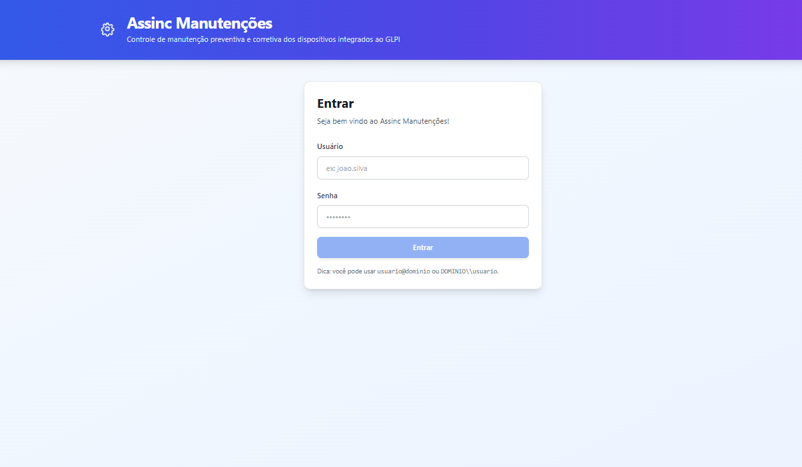

### Tela principal (Home)

Dashboard inicial com atalhos, indicadores e acesso rápido aos módulos.

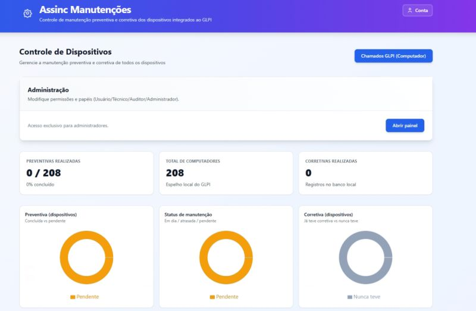

### Menu do usuário

Card com dados do usuário logado, sessão e opções relacionadas.

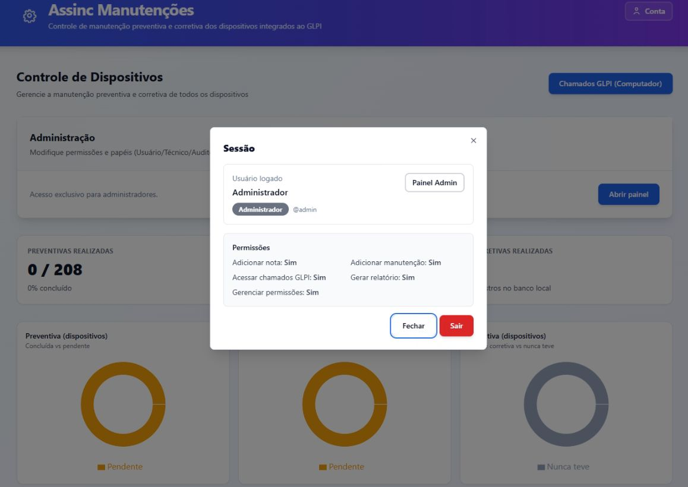

### Inbox de chamados GLPI (Computador)

Modal de chamados do GLPI na categoria Computador: lista/aba de status e detalhes.

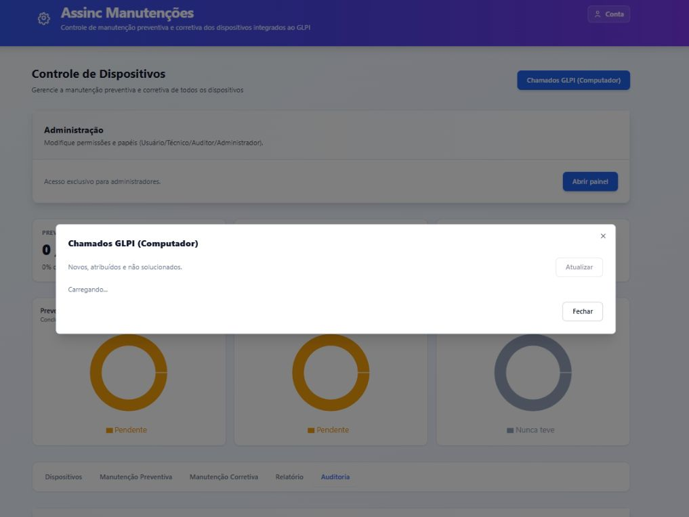

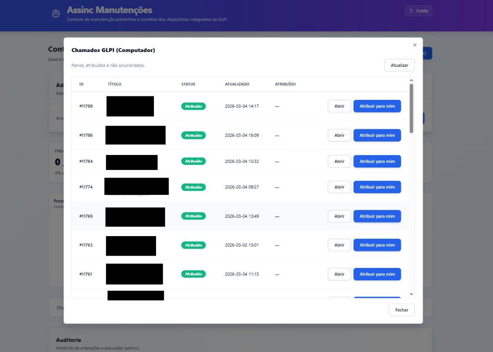

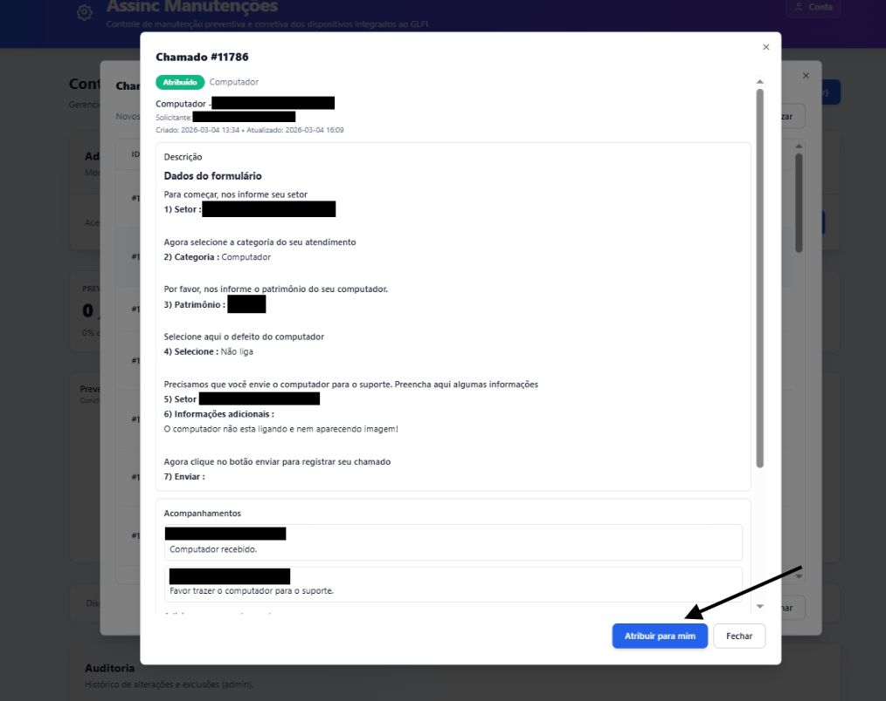

### Dispositivos

Tela de listagem/consulta de dispositivos sincronizados do GLPI.

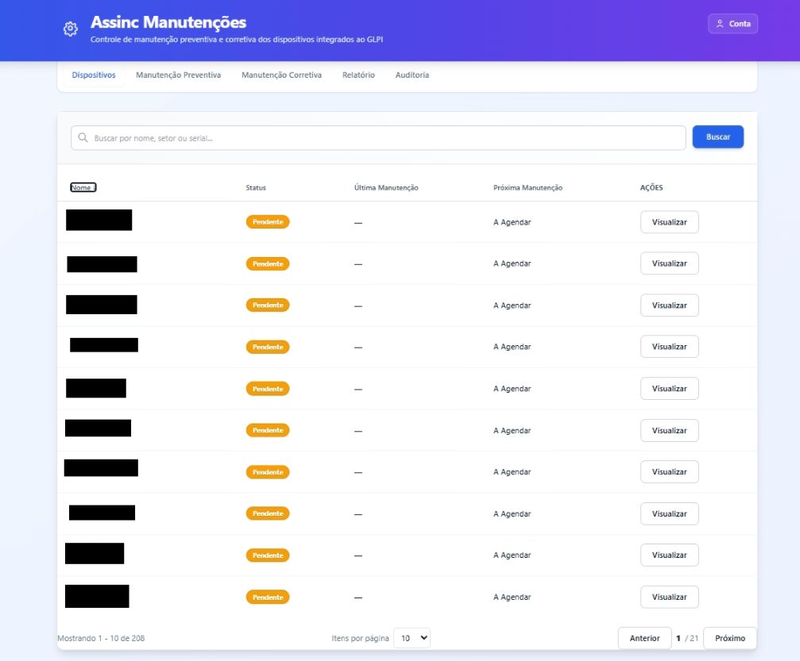

### Detalhe do dispositivo

Detalhes do dispositivo: componentes, notas e histórico.


### Notas do dispositivo

Registro de notas internas por dispositivo (conforme permissões).

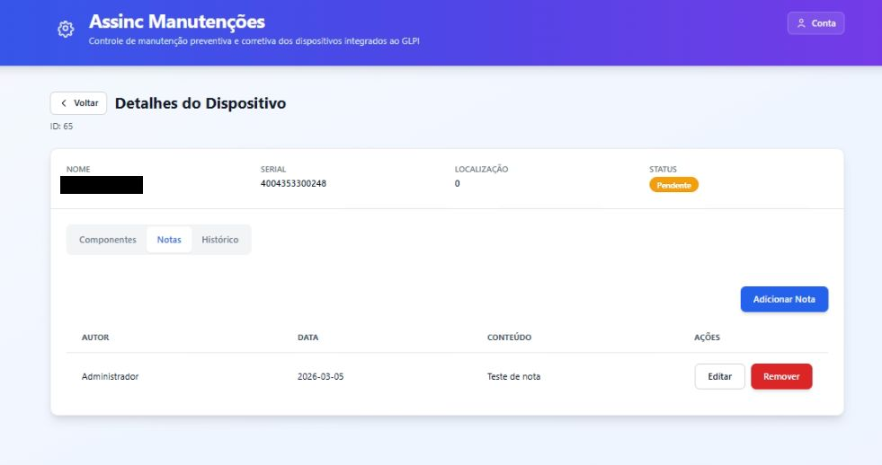

### Histórico do dispositivo

Histórico de manutenções e registros vinculados ao dispositivo.

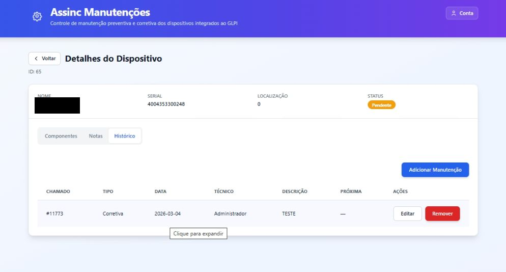

### Registrar manutenção

Modal para registrar manutenção (com vinculação obrigatória a chamado do GLPI).

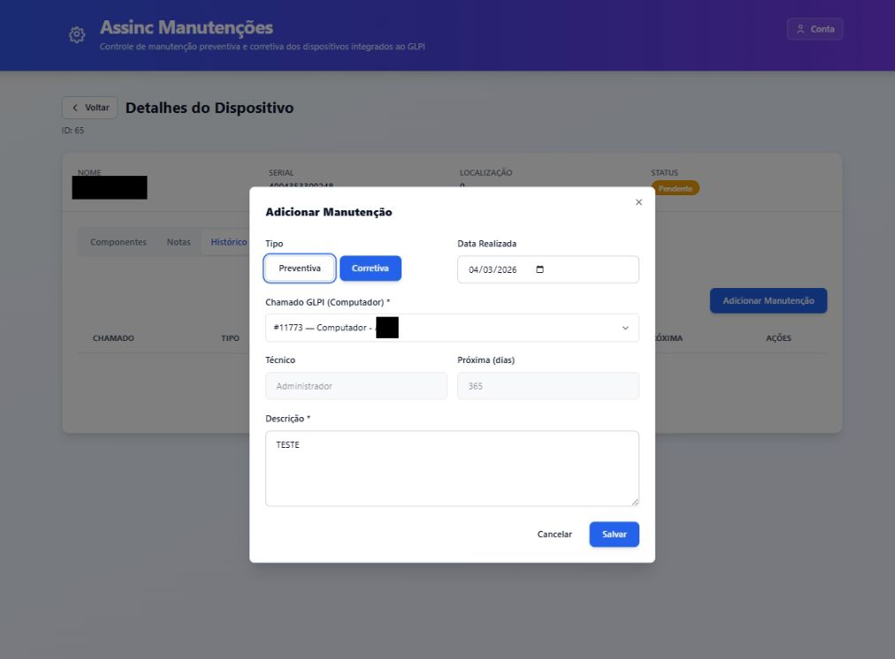

### GLPI (vínculo e observação)

Visões relacionadas ao chamado GLPI vinculado e à observação registrada.

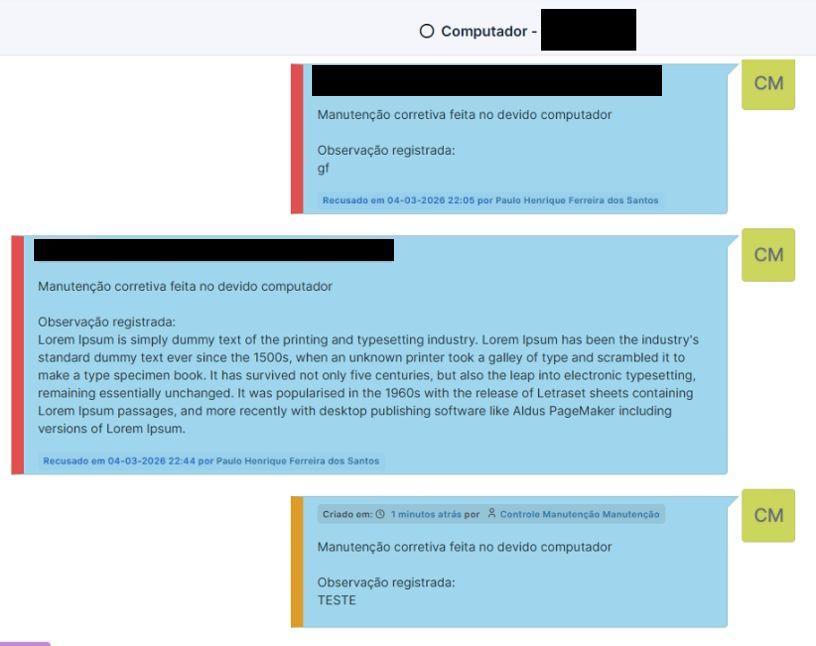

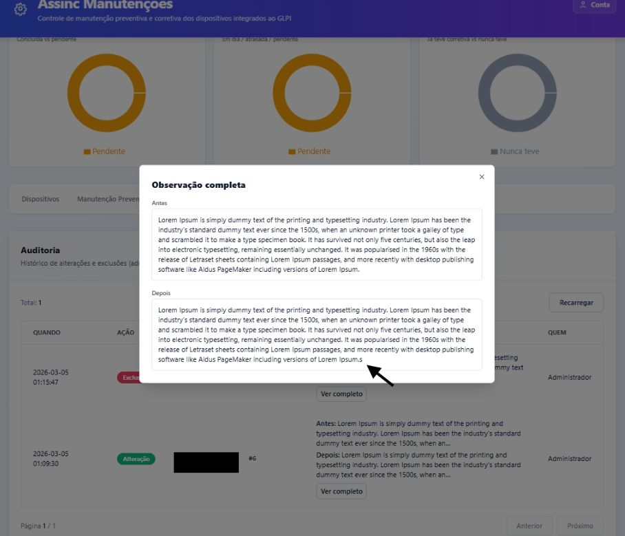

### Relatórios

Tela de relatórios com filtros e exportação.

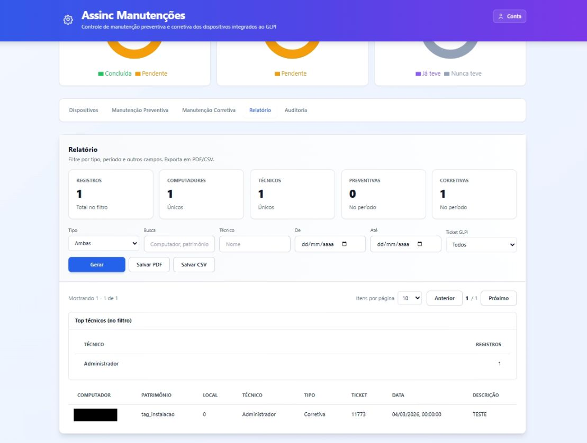

### Auditoria

Auditoria global (admin): histórico de alterações e exclusões, com detalhes antes/depois quando aplicável.

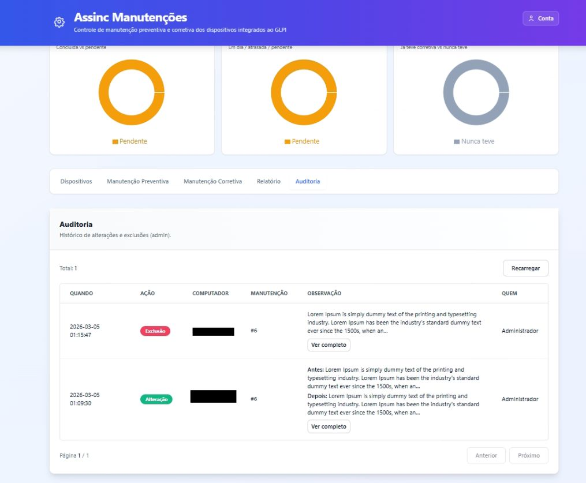

### Administração

Tela administrativa para gestão de permissões e configurações.

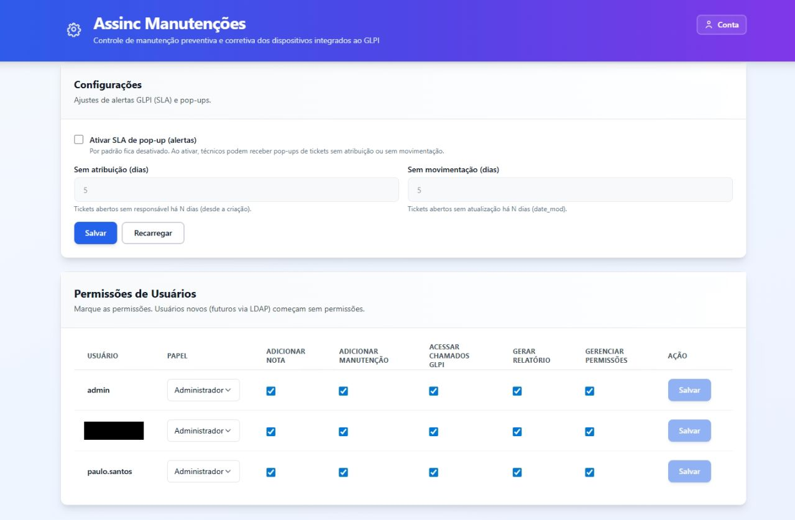

### Plugin no GLPI

Ação automática/cron no GLPI para disparar sincronização via webhook.

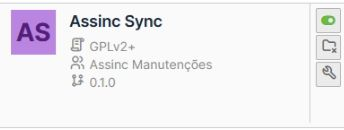

## Autenticação

- Login padrão é **local** (tabela de usuários no banco) e emite JWT.
- Existe suporte opcional para LDAP/AD (controlado por variável de ambiente), mas o login local continua disponível.

Usuário inicial (seed): **admin/admin**.

## Modelagem e integridade do sync

- A chave estável do dispositivo é o `glpi_id`.
- O banco tem `glpi_id` como **UNIQUE** para impedir duplicidade.
- O sync é idempotente: se o nome do PC mudar no GLPI, o registro é **atualizado**, não duplicado.

## Como rodar (Windows)

### Pré-requisitos

- Node.js (LTS)
- Python 3.11+ (ou compatível com as dependências)
- MySQL (XAMPP ou MySQL Server)

### 1) Banco de dados

Crie o banco e usuário local (exemplo):

- Script: [python-api/init_local_mysql.sql](python-api/init_local_mysql.sql)

> As tabelas são criadas automaticamente pelo SQLAlchemy ao iniciar a API.

### 2) Backend (FastAPI)

1) Configure variáveis de ambiente:

- Copie [python-api/.env.example](python-api/.env.example) para `python-api/.env`
- Preencha `DB_*`, `GLPI_APP_TOKEN`, `GLPI_USER_TOKEN` e troque `JWT_SECRET`

2) Instale dependências:

```bash
cd python-api
pip install -r requirements.txt
```

3) (Opcional) Rode o sync manual 1x:

```bash
python tools\run_sync.py
```

4) Suba a API:

```bash
uvicorn app.main:app --host 127.0.0.1 --port 8000 --reload
```

Health check:

- `http://127.0.0.1:8000/api/health`

Mais detalhes: [python-api/README.md](python-api/README.md)

### 3) Frontend (Next.js)

1) Configure o endpoint do backend:

- Crie/ajuste `Frontend/.env.local` (use como base [Frontend/.env.local.example](Frontend/.env.local.example))

Exemplo:

```env
NEXT_PUBLIC_PY_API_URL=http://127.0.0.1:8000
```

2) Instale e rode:

```bash
cd Frontend
npm install
npm run dev
```

Mais detalhes: [Frontend/README.md](Frontend/README.md)

## Rodar em rede (outros locais / outra máquina)

Quando você quer acessar o sistema de **outro computador** (rede interna), o ponto principal é:

1) O backend precisa escutar fora do `localhost`.
2) O firewall/roteador precisa permitir a porta.
3) O backend precisa permitir CORS para a URL do frontend.

### Backend: bind em 0.0.0.0

No servidor onde roda a API:

```bash
uvicorn app.main:app --host 0.0.0.0 --port 8000
```

Isso faz a API escutar em todas as interfaces de rede. O acesso passa a ser por:

- `http://IP_DO_SERVIDOR:8000/api/health`

### CORS (obrigatório para acesso via navegador)

No `python-api/.env`, inclua a origem do frontend em `CORS_ORIGINS`.

Exemplo (se o frontend estiver em `http://192.168.1.50:3000`):

```env
CORS_ORIGINS=http://localhost:3000,http://192.168.1.50:3000
```

### Frontend apontando para a API

No computador/servidor onde roda o Frontend, ajuste `Frontend/.env.local`:

```env
NEXT_PUBLIC_PY_API_URL=http://IP_DO_SERVIDOR:8000
```

Se estiver usando Docker para o frontend, o server-side do Next pode usar a URL interna (opcional):

```env
PY_API_INTERNAL_URL=http://api:8000
```

### Firewall (Windows/Linux)

Se o servidor for Windows, libere a porta 8000 (API) no Firewall (PowerShell como Admin):

```powershell
New-NetFirewallRule -DisplayName "Assinc API 8000" -Direction Inbound -Action Allow -Protocol TCP -LocalPort 8000
```

Se o frontend também for acessado de outros PCs, libere a porta 3000:

```powershell
New-NetFirewallRule -DisplayName "Assinc Front 3000" -Direction Inbound -Action Allow -Protocol TCP -LocalPort 3000
```

Em Linux (UFW):

```bash
sudo ufw allow 8000/tcp
sudo ufw allow 3000/tcp
```

Recomendação de segurança: se for expor fora da rede local, prefira usar reverse proxy com HTTPS e restringir IPs/rotas.

## Dicas de operação

- Se a API do GLPI bloquear seu IP (`ERROR_NOT_ALLOWED_IP`), você precisa liberar o IP do servidor que roda o backend no cliente da API do GLPI.
- Para rodar sync automático 1x por dia, existe um script em [python-api/tools/daily_sync.sh](python-api/tools/daily_sync.sh).
- Alternativa: instalar o plugin em [glpi-plugin/assincsync](glpi-plugin/assincsync) para o próprio GLPI disparar o sync via webhook (sem script no servidor).

### Onde configurar IPs/segurança

- Backend → GLPI (quando a Python API consulta o GLPI via `GLPI_APP_TOKEN`/`GLPI_USER_TOKEN`):
	- No GLPI: **Setup/Configurar → Geral/General → API → Clientes da API (API clients)**
	- No cliente do seu **App-Token**, adicione o **IP do servidor onde roda a Python API** (isso resolve `ERROR_NOT_ALLOWED_IP`).

- GLPI → Backend (quando o plugin chama o webhook da Python API):
	- Na Python API (`python-api/.env`):
		- `GLPI_WEBHOOK_TOKEN` (segredo compartilhado)
		- (opcional) `GLPI_WEBHOOK_ALLOWED_IPS` (allowlist do IP do servidor do GLPI)
	- Recomendações: use HTTPS e/ou restrinja via firewall/reverse-proxy para aceitar somente o IP do GLPI.

## Para recrutadores

Este repositório demonstra:

- Integração com sistema legado (GLPI) de forma segura (read-only + espelho local)
- Backend com FastAPI + SQLAlchemy, endpoints e validações
- Frontend moderno com Next.js, rotas protegidas e UX orientada a permissões
- Preocupação com confiabilidade (sync idempotente + constraints no banco)

## Licença

Defina a licença conforme sua necessidade (ex.: MIT) antes de publicar externamente.
